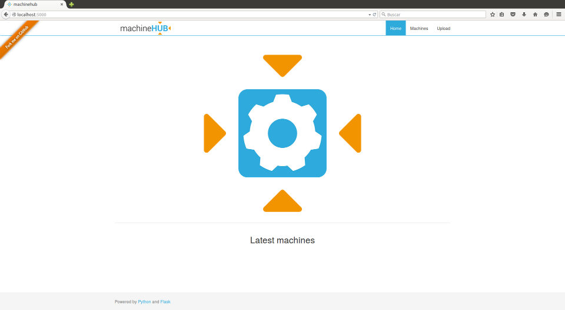
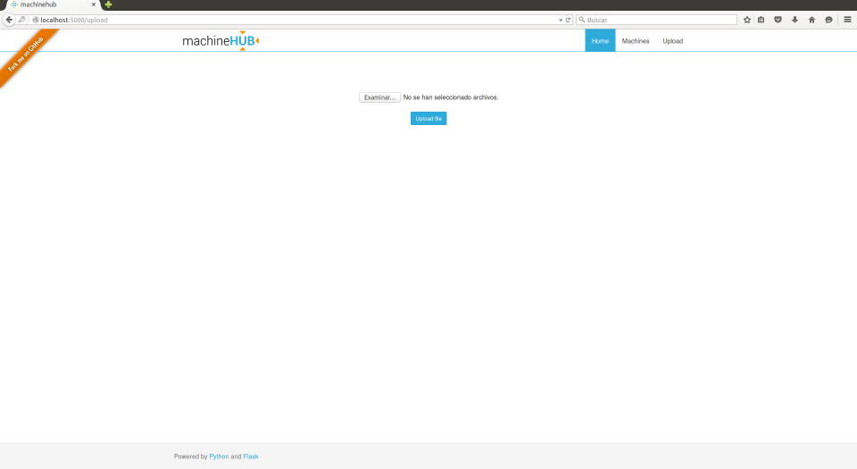
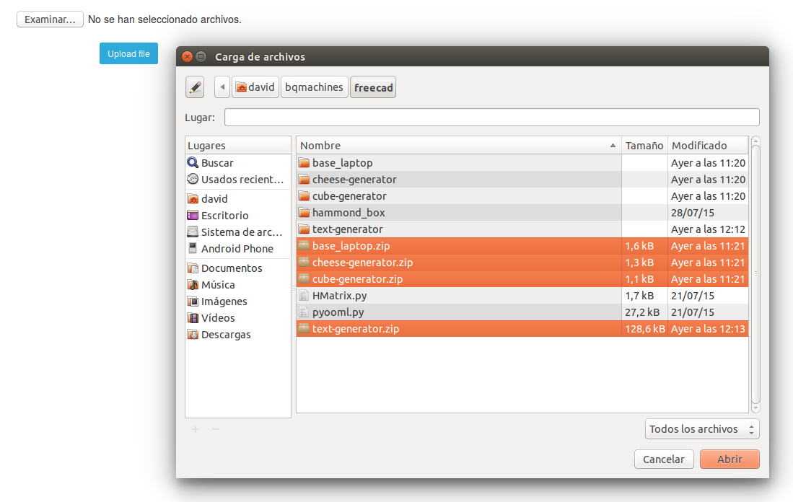
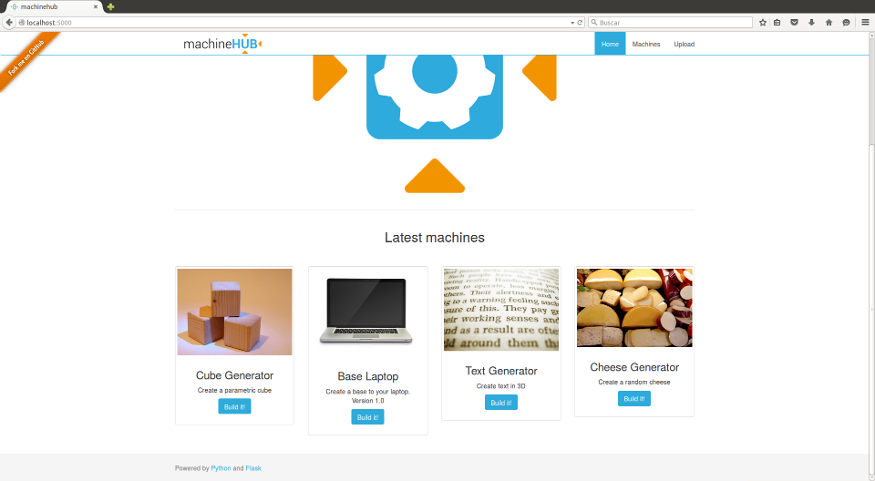

[](http://opensource.org/licenses/GPL-3.0) 
[](https://readthedocs.org/projects/machinehub/?badge=latest)
[](https://groups.google.com/forum/?hl=en#!forum/machinehub)
[](https://www.python.org/downloads/)

# What is [machineHUB](docs/machinehub.pdf) ?

## Discover our [machines](https://github.com/bq/machines/)

## Installation

### System dependencies

**[Install FreeCAD](http://www.freecadweb.org/wiki/index.php?title=Install_on_Unix)**


```bash
# Install FreeCAD
sudo add-apt-repository ppa:freecad-maintainers/freecad-stable
sudo apt-get update
sudo apt-get upgrade
sudo apt-get install freecad freecad-doc
```

**[Install Docker](https://docs.docker.com/installation/ubuntulinux/)**

```bash
# Install Docker
sudo apt-get install wget
wget -qO- https://get.docker.com/ | sh
sudo service docker start
```

`Warning`

```bash
# Create a Docker group
sudo usermod -aG docker ubuntu
```

### Python requirements

```bash
cd machinehub
sudo -H pip install -r requirements.txt
```

## Execute

Build the machinehub docker image to use as base to the machine images.

```bash
cd machinehub/machinehub/docker/
docker build -t machinehub .
```

Launch the webapp.

```bash
cd machinehub
python launcher.py
```

gunicorn.

```bash
cd machinehub
gunicorn -w 8 -b 127.0.0.1:5000 launcher:app
```

## Configure

### How to change the address or the admin info

Edit `~/.machinehub/machinehub.conf` yo chage the address, port, or the admin info.

```
[server]
host: 127.0.0.1
port: 5000
[users]
admin: admin #user: password
```

# Try Machinehub

[localhost:5000](http://localhost:5000/)



[localhost:5000/upload](http://localhost:5000/upload)



Select all the machine .zip files.



Clic in the blue upload button and machinehub will redirect your browser to the home page with the machines. loaded


